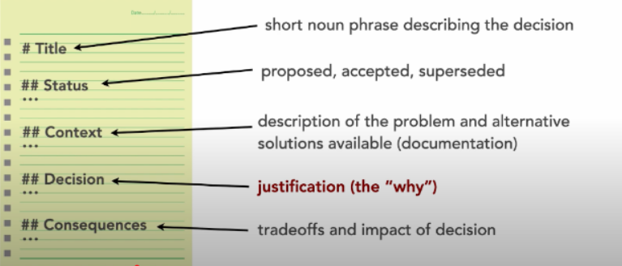
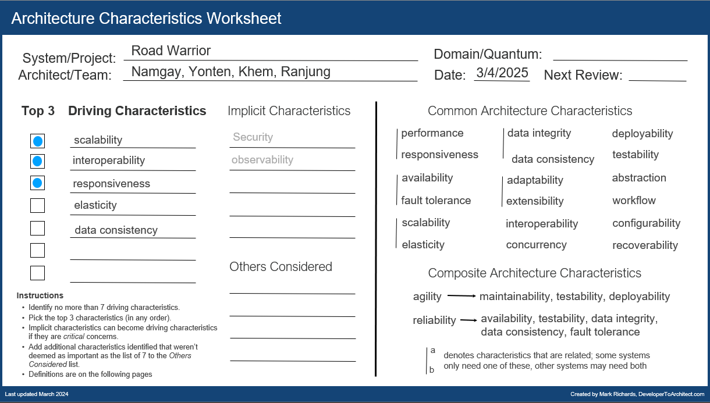

## Identifying Architectural Characteristics: The Road Warrior

## Context

### The Road Warrior
A major travel agency wants to build the next generation online trip management dashboard to allow travelers to see all of their existing reservations organized by trip either online or through their mobile device with an app.

- Users: 10,000+ registered users worldwide
### Requirements:
1. The system must interface with the agency’s existing airline, hotel, and car rental interface system to automatically load reservations via frequent flier accounts, hotel membership point accounts, and car rental rewards accounts.

2. Customers should be able to add existing reservations manually as well.

3. Items in the dashboard should be able to be grouped by trip, and once the trip is complete, the items should automatically be removed from the dashboard.

4. Users should also be able to share their trip information by interfacing with standard social media sites.

5. Richest user interface possible across all deployment platforms

### Additional Context:
- must integrate seamlessly with existing travel systems
- partnership deals are being negotiated to create 'favored' vendors
- must work internationally

For this practical purpose, which is to identify the architectural characteristics, we have referenced the image below to identify some of the driving characteristics with valid decisions and tradeoffs.

  

## Top 3 Driving Characteristics Identified

  

## 1. Interoperability

(The ability of the system to interface and interact with other systems to complete a business request, such as airlines, hotels, car rentals, and social media platforms.)

**Title: Integrating with External Systems via APIs for Real-Time Data Exchange.**

### Reason
With reference to Requirement (1) where (The system must interface with the agency’s existing airline, hotel, and car rental interface system to automatically load reservations via frequent flier accounts, hotel membership point accounts, and car rental rewards accounts), interoperability is critical to ensure that the system can communicate effectively with multiple external systems.

The system must be able to pull reservation data from airlines, hotels, and car rental services, as well as share trip information on social media platforms. Without interoperability, the system cannot fulfill its core functionality.

### Architecture Decision
To achieve interoperability, the system can use RestfulAPIs and data formats (e.g., JSON, XML) for communication with external systems. For example:

- The system will integrate with airline, hotel, and car rental APIs to fetch reservation data in real time.
Social media integrations will use OAuth-based authentication to securely share trip information.

- This decision is to address the feasibility and functionality of the system, as it must work seamlessly with existing travel systems and social media platforms.

### Tradeoff and Mitigation
While interoperability ensures seamless integration, it introduces a tradeoff with complexity. Managing multiple integrations with different APIs and data formats can increase development and maintenance effort.

## 2. Scalability

(A function of system capacity and growth over time; as the number of users or requests increase in the system, responsiveness, performance, and error rates remain constant.)

**Title: Handling Increasing User Load with Cloud-Based Horizontal Scaling.**

### Reason
With reference to the user base of 10,000+ registered users worldwide and the potential for growth, scalability is critical to ensure that the system can handle increasing uses, especially during peak travel seasons (vacations & holidays)

The system must be able to support a large number of simultaneous users, each making requests to load reservations, group trips, and share information on social media. Without scalability, the system could become slow or unresponsive, leading to a poor user experience.

### Architecture Decision
To achieve scalability, the system will be built on a cloud-based infrastructure that supports horizontal scaling. For example:

- The system will use load balancers to distribute traffic/reduce overhead across multiple servers.
Databases will be sharded to handle large volumes of data efficiently.

- This decision is to address the performance and availability of the system, ensuring that it can handle growth without compromising user experience.

### Tradeoff and Mitigation
While scalability ensures the system can handle growth, it introduces a potential tradeoff with cost. Scaling resources (e.g., servers, databases) can increase operational expenses. To mitigate this, the system will implement auto-scaling to dynamically allocate resources based on demand, ensuring cost efficiency during periods of low usage.

## 3. Responsiveness

(The amount of time it takes to get a response to the user.)

**Title: Optimizing Data Fetching and Caching for Faster User Interactions.**

### Reason
With reference to Requirement (5) where (The system must provide the richest user interface possible across all deployment platforms), responsiveness is critical to ensure that users can interact with the system seamlessly, whether they are accessing it via a web browser or a mobile device.

Users expect quick loading times and smooth interactions when managing their trips, such as adding reservations, grouping trips, or sharing information on social media. Without responsiveness, the system could frustrate users and lead to a poor product quality experience.

### Architecture Decision
To achieve responsiveness, the system will implement caching and optimized data fetching mechanisms. For example:

- Frequently accessed data (e.g., upcoming trips) will be cached locally to reduce the need for repeated requests to external systems.
- The system will prioritize loading critical information (e.g., trip summaries) first, while less critical data (e.g., detailed reservation information) is loaded in the background.

This decision is to address the user experience and performance of the system, ensuring that users can interact with the system quickly and smoothly.

### Tradeoff and Mitigation
While caching improves responsiveness, it introduces a potential tradeoff with data consistency. Cached data may become stale if not updated regularly. To mitigate this, the system will implement a cache invalidation strategy to ensure that cached data is updated whenever there are changes in the external systems (e.g., new reservations added via airline, hotel, or car rental systems). This ensures that users always see the most up-to-date information without compromising responsiveness.

