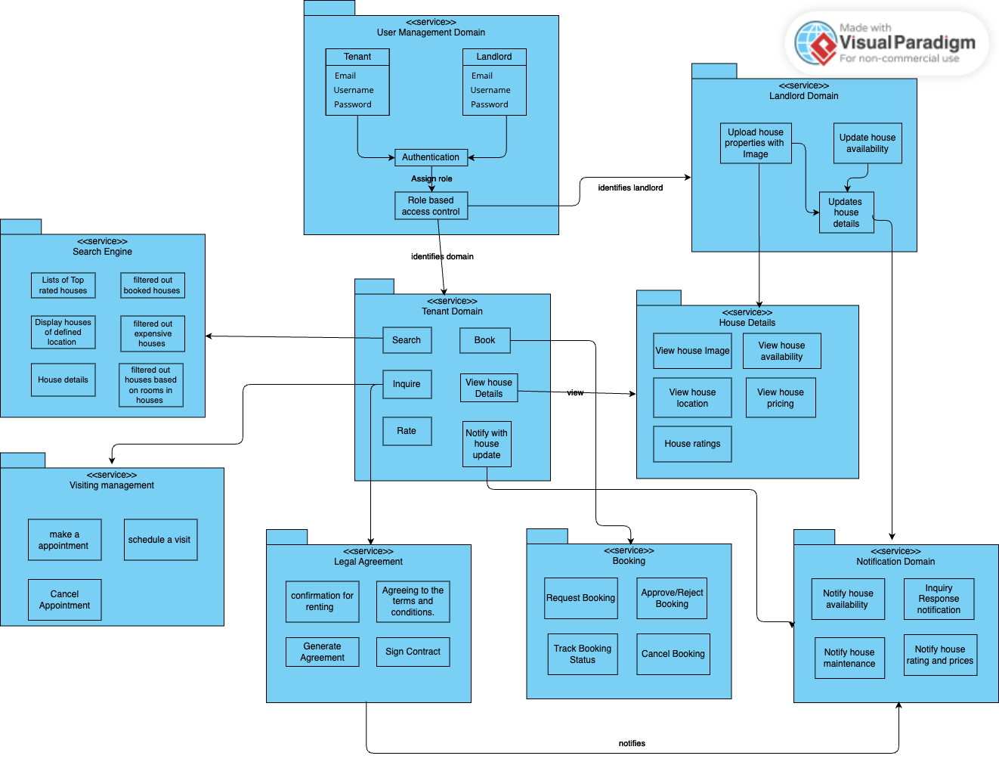

# House Renting Domain Model

## Introduction 

This report presnt the domain model for House Renting, which includes glossary of domain terms and a visual diagram of domain model. House Renting system is developed to help the landlord and tenants to come together in single platform to resgister and rent the property which makes convinent for both the actors. 

## Glossary of Domain's Terms

  

### **1. User Management Domain**  

- User: person interacting with the system, either as a tenant searching for rental properties or a landlord listing properties.  
- Tenant: user who rent the property.  
- Landlord: user who owns a property and lists it for rent.  
- User Profile: collection of personal details including name, email, phone number, and role (tenant or landlord).  
- Authentication: The process of verifying a user's identity through login credentials.  
- Password Policy: security rules governing password creation (e.g., length, complexity).  

### 2. Property Listing Domain  

- Property: a house, apartment listed for rent, including attributes like location, rent price and type.  
- Property Listing: an entry created by a landlord detailing a rental property.  
- Property Features: specific attributes of a property, such as the number of bedrooms, bathrooms, parking, and amenities.  
- Availability Status: indicates whether a property is available, booked or occupied.  
- Rent Price: he cost of renting the property per month.  
- Lease Term: agreed rental duration (e.g., month-to-month, yearly).  

### 3. Search and Filtering Domain  

- Search Feature: system component that allows users to search for rental properties based on criteria.  
- Search Filters: options that help tenants filter out search results (e.g., price range, location, number of rooms).  
- Property Geolocation: the geographic coordinates of a rental property, used for mapping and navigation.  
- Sort Options: criteria for sorting listings (e.g., price low to high, newest listings).

### 4. Booking and Rental Process Domain  

- Booking Request: a request sent by a tenant to the landlord to rent a property.  
- Rental Agreement: a contract outlining the terms between the landlord and tenant, including payment terms and responsibilities.  
- Rent Payment: monthly payment made by the tenant to the landlord.   
- Move-in Date: the date a tenant is allowed to occupy the rental property.  
- Lease Renewal: the process of extending a rental agreement before it expires.  

### 5. Review and Feedback Domain  

- Review System: component allowing tenants to submit feedback about a property or landlord.  
- Review: written evaluation of a rental experience submitted by a tenant.  
- Rating: numerical score given to a landlord or property.  
- Complaint System: feature that allows tenants to report issues regarding the property or landlord.  

### 6. Notification Domain  

- Notification Service: manages alerts sent to users regarding property updates and booking status. 
- Booking Confirmation: notification sent when a landlord approves a booking request.   
- Lease Expiry Alert: notification sent to tenants and landlords when a lease is about to expire.  

## Conclusion

The domain model for the House Renting System defines key entities like landlords, tenants, properties and rental agreements, ensuring seamless interactions. It provides a clear structure for managing listings, bookings, and lease terms, helping streamline the rental process for all users.