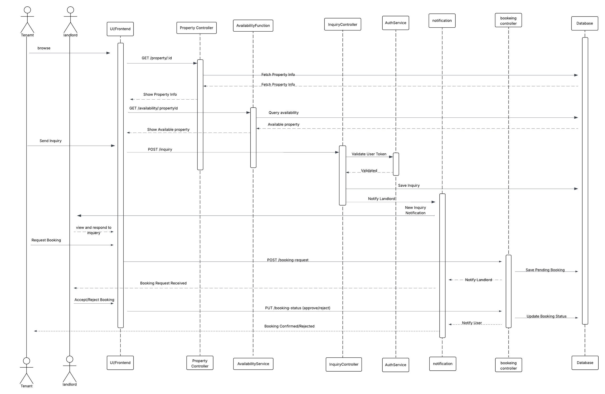

# House Renting System – Sequence Diagram

### Title 

### Sequence Diagram for house renting system inspired by Airbnb 

### Objective

The aim of this practical is to design UML sequence diagram that shows the process of listing the property and renting it, simulating a real world online house renting system similar to **Airbnb**.

In this practical, we have included only the main features of a house renting system, focusing mainly on property listing and booking functionalities.

### Landlord

---

### Tenant

### What I learned

- How to model real-world processes using sequence diagram.
- How the system components interact with eachother to accomplish specific tasks. 
- Mainly the logic in flow design.
- How diagrams helps in building clear documentation before actual development. 

### Reflection 
This exercise helped me better visualize how a complex feature like booking can be broken down into simpler components. It taught me to think not only from a developer's perspective but also from a user and business logic point of view.