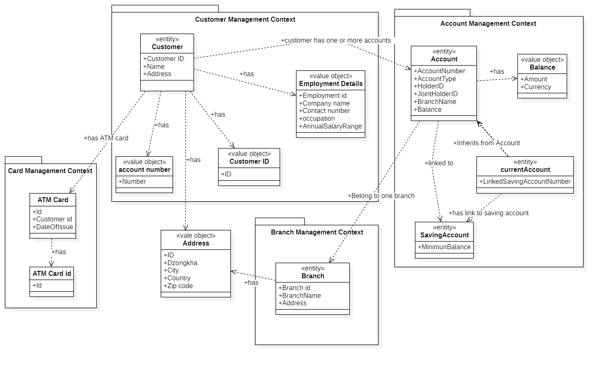

## Banking Domain Model - Domain Driven Design

1. Customers can open either savings or current accounts.

2. Each account may have one or two holders, allowing for single or joint ownership.

3. A customer can maintain multiple accounts within the bank.

4. Each customer is eligible for only one ATM card, regardless of the number of accounts held.

5. All accounts are associated with specific bank branches.

6. Customer information is stored independently of account status, ensuring it remains available even if accounts are closed.

### Task 1: Domain Object Identification

### Bounded Contexts

- Customer Management Context:

  Responsible for managing customer-related data, including personal details, employment information.

- Account Management Context:

  Handles the full lifecycle of account operations such as account creation, balance management, and support for different account types.

- Branch Management Context:

  Manages data related to bank branches, including branch-specific information and geographical location details.

- ATM Card Management Context:

  Manages the issue of ATM cards and links them to the customer. Even if the customer has multiple accounts, only one ATM card is allowed per customer.

### Aggregates

### Customer Aggregate

**Aggregate Root: Customer**

- Entities:

    - Customer

- Value Objects:

    - Employment Details

    - Address

    - customerID (Identifier)

    - accountNumber (Identifier)

### Account Aggregate

**Aggregate Root: Account**

- Entities:

  - Account

  - Saving Account (inherits from Account)

  - Current Account (inherits from Account)

- Value Objects:

  - Balance

### Branch Aggregate

**Aggregate Root: Branch**

- Entities:

  - Branch

- Value Objects:

  - Address

### ATM Card Management

**Aggregate Root: ATM Card**

- Entities:

  - ATM Card

- Value Objects:

  - ATM Card ID (Identifier)

## Entities :

| Entity         | Attributes |
|----------------|-----------------------------------------|
| **Customer**   | customerID, Name, Address (Address), AccountNumber |
| **Account**    | AccountNumber, AccountType, HolderID, JointHolderID, BranchName, Balance (Balance) |
| **SavingAccount** | MinimumBalance |
| **CurrentAccount** | LinkedSavingAccountNumber |
| **Branch**     | BranchID, BranchName, Address (BranchAddress) |
| **ATMCard**    | Id, CustomerID, DateOfIssue |

## Value Objects:

| Value Object         | Attributes |
|----------------|-----------------------------------------|
| **EmploymentDetails** | EmploymentID, CompanyName, ContactNumber, Occupation, AnnualSalaryRange |
| **Address** | Street, City, State, ZipCode |
| **ATMCard**    | Id, CustomerID, DateOfIssue |
| **Balance**    | Amount, Currency |
| **AccountNumber**     | Number |
| **CustomerID**        | Id |

## Task 2: Relationships and Associations

In this task, I analyzed how different domain entities such as Customer, Account, and Branch relate to each other in a banking system. Understanding these relationships is crucial for structuring data and defining interactions between different parts of the system using Domain-Driven Design (DDD) principles.

- **Customer and Employment Details (1:1 Composition)**

  A customer's employment information is directly tied to them. Both have the same lifecycle, meaning if the customer is removed, their employment details are removed too. This close dependency represents a composition relationship.

- **Customer and Address (1:1 Composition)**

  Each customer has a single address, which is a value object. The address exists only as part of the customer’s profile and  doesn't have a separate identity, making this another example of composition.

- **Customer and ATM Card (0..1 Aggregation)**

  A customer might have an ATM card, but it’s not guaranteed. The card itself can continue to exist even if the customer record is deleted. This looser connection is best represented as aggregation.

- **Account and Money (1:1 Composition)**
    
  The account’s balance is represented by a value object called Money, which is an internal part of the account. Since this value has no meaning outside of the account, the relationship is compositional.

- **Account and Account Type (1:1 Association)**

  Every account is linked to a specific type (e.g., Savings, Current), usually selected from a predefined list or enumeration. This is modeled as a simple association.

- **Saving Account and Current Account (Optional Bidirectional Association)**

  In some cases, a savings and a current account might be linked together. This link isn’t mandatory for either side, which means it’s a two-way, optional association.

### Cross-Context Relationships

- **Customer and Account (1 to Many Association)**

  A customer can have multiple accounts or even none. This is represented by storing account identifiers within the customer’s profile. It’s a typical association between entities.

- **Account and Branch (Many to One Association)**

  Multiple accounts are linked to a single branch. However, the branch doesn’t track which accounts belong to it. This unidirectional relationship is a basic association.

- **Account and Customer (1 to 1 or 2 Association)**

  An account must have one or two owners, supporting both individual and joint accounts. This is captured using identifiers like HolderID and JointHolderID inside the account entity.

- **Account and ATM Card (0..1 Association)**

  A customer may be issued one ATM card, regardless of how many accounts they hold. The card is linked to the customer (not directly to any account) and can exist independently. 

## Key Learnings from the Task

This task helped me better understand how to design systems using Domain-Driven Design:

- I identified different domain components like entities and value objects.

- I organized them into bounded contexts, separating concerns between customers, accounts, and branches.

-  I created aggregates with clearly defined aggregate roots. 

- I also learned how to choose the right type of relationship - whether composition, aggregation, or association - based on how tightly the components are connected.

Most importantly, I realized the value of separating responsibilities into focused modules. For example, customer details are handled in their own context, independent of account operations. This approach keeps the system more modular, understandable, and adaptable as business rules evolve.