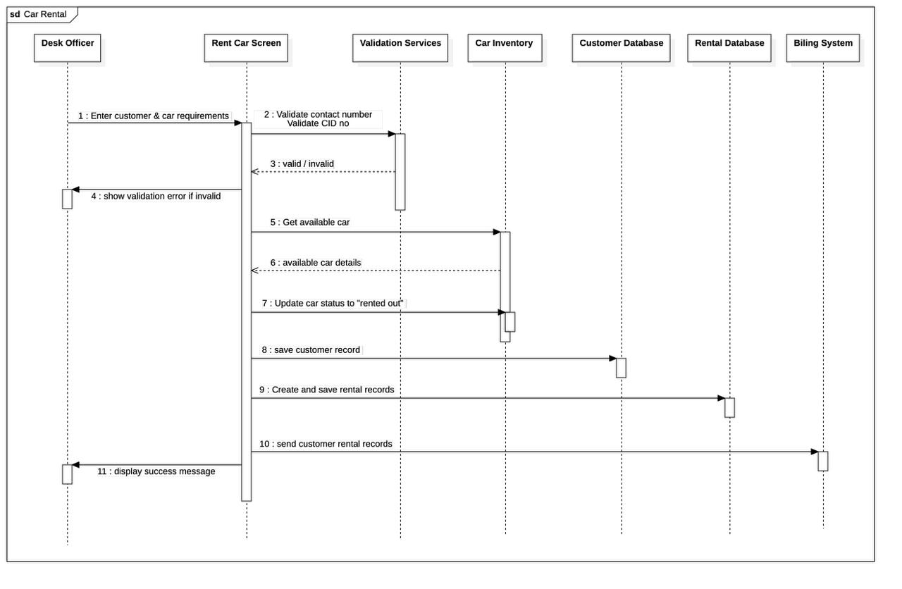

## Car Rental Sequence Diagram

**1. Introduction**

This report explains the steps involved when a customer wants to rent a car. The sequence diagram shows how different parts of the system (people and software) work together to complete the car rental process - from entering the customer's details to successfully renting out a car.

## Diagram Overview

## **2. Who Is Involved?**

Here are the main people and systems involved in the process:

- **Desk Officer:** The person who helps the customer at the counter.

- **Rent Car Screen:** The screen or system used to input and manage car rental data.

- **Validation Services:** The part of the system that checks if the customer's contact number and CID (Citizen ID) are correct.

- **Car Inventory:** The system that keeps track of which cars are available or already rented.

- **Customer Database:** Where customer information is saved.

- **Rental Database:** Where rental details are stored.

- **Billing System:** (Listed in the diagram but not used directly in this process.)

## **3. Step-by-Step Explanation**

**Step 1: Enter Customer and Car Requirements**

- The Desk Officer begins the process by entering the customer's personal information and car preferences into the Rent Car Screen.

- This includes details such as contact number, CID number, and desired car type.

**Step 2: Validate Customer Information**

- The Rent Car Screen sends the entered contact number and CID to the Validation Services.

- This step ensures the provided information is correct and meets the system’s validation rules.

**Step 3: Return Validation Result**

- The Validation Services checks the details and sends back a response: either "valid" or "invalid".

- If invalid, the process does not move forward.

**Step 4: Show Validation Error (If Any)**

- If the contact number or CID is invalid, the Rent Car Screen shows an error message to the Desk Officer.

- The Desk Officer can then correct the mistake and retry.

**Step 5: Get Available Cars**

- Once the data is validated, the system requests a list of available cars from the Car Inventory.

- This helps the officer choose a car that is currently not in use.

**Step 6: Receive Available Car Details**

- The Car Inventory sends back the details of cars that are available for rent.

- This may include car model, type, fuel type, and rental status.

**Step 7: Update Car Status**

- After a car is selected, the system updates the car’s status in the Car Inventory to “rented out”.

- This prevents the car from being shown as available to other customers.

**Step 8: Save Customer Information**

- The system now stores the customer’s validated information (name, contact, CID, etc.) in the Customer Database.

- This step is important for record keeping and future reference.

**Step 9: Create and Save Rental Records**

- A rental record is created containing:

    - The car details

    - Customer ID

    - Rental date

    - Duration of the rental

- This information is saved in the Rental Database for tracking purposes.

**Step 10: Send Rental Record to Screen**

- After saving the rental data, the system sends a copy of the rental record back to the Rent Car Screen.

- This confirms that all steps have been completed successfully.

**Step 11: Display Success Message**

- Finally, the Desk Officer sees a success message on the screen.

- This message confirms that:

    - The car has been successfully rented
    - The customer’s data and rental details have been saved
    - The process is complete and successful